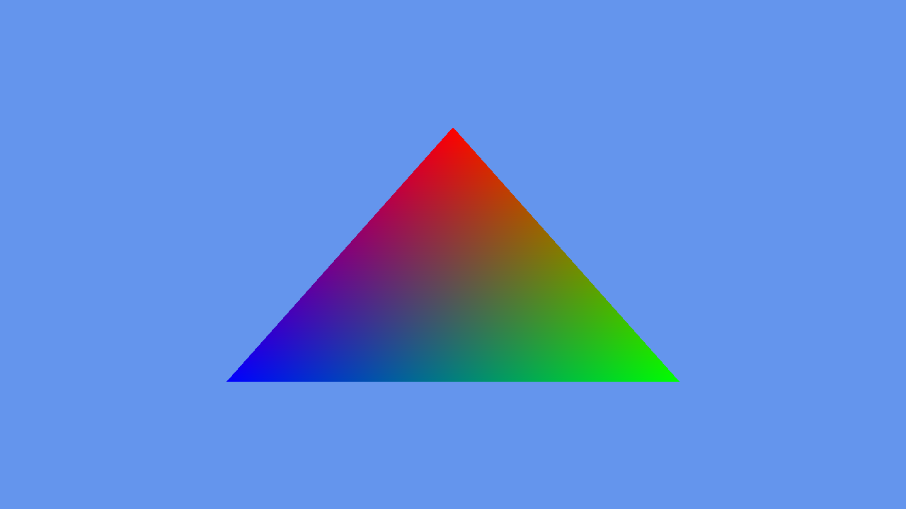
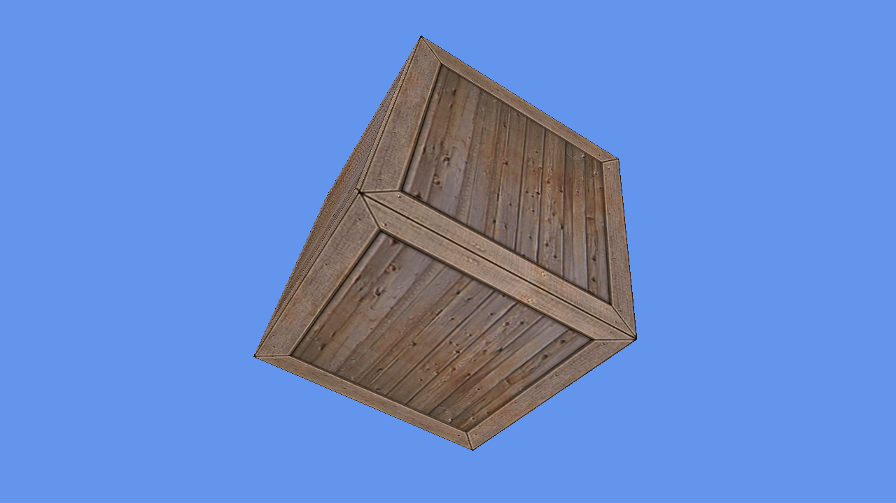
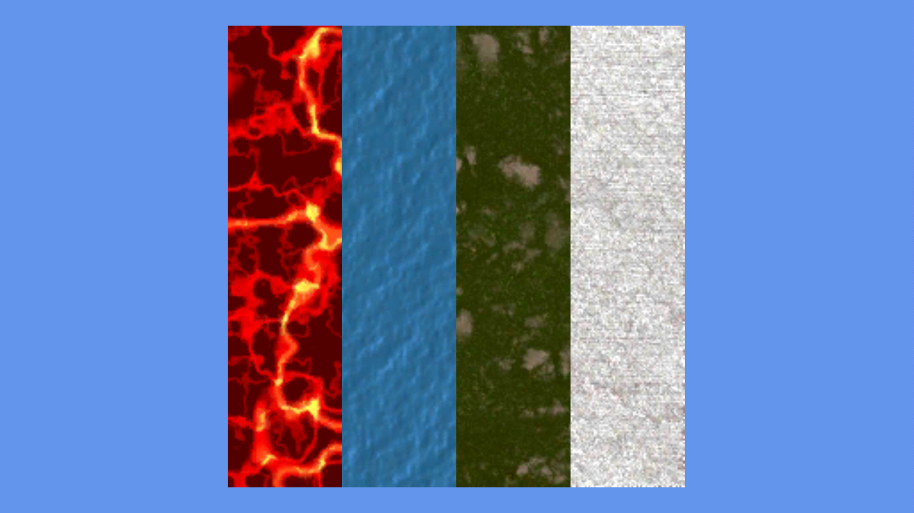
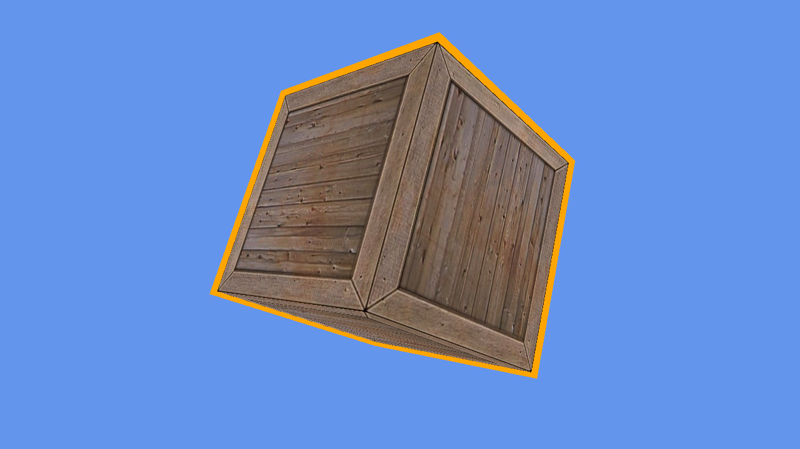
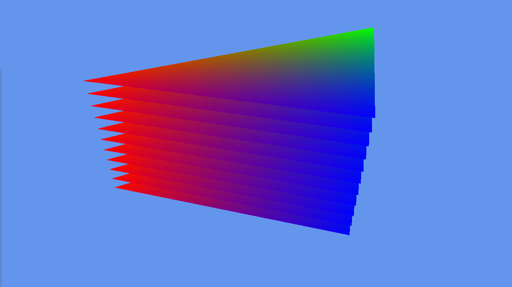
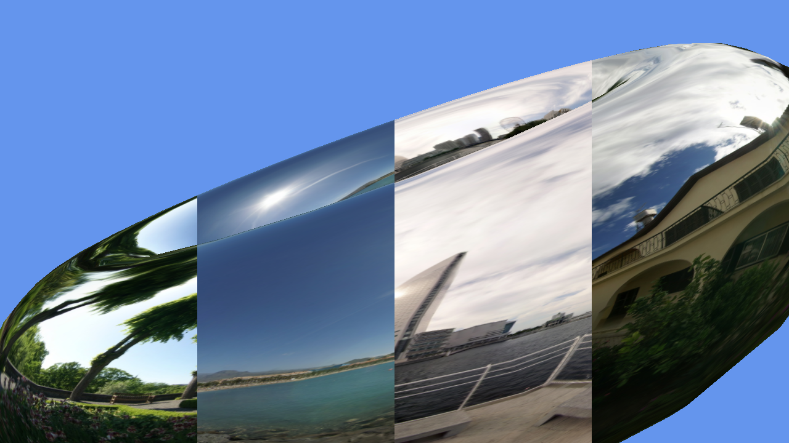
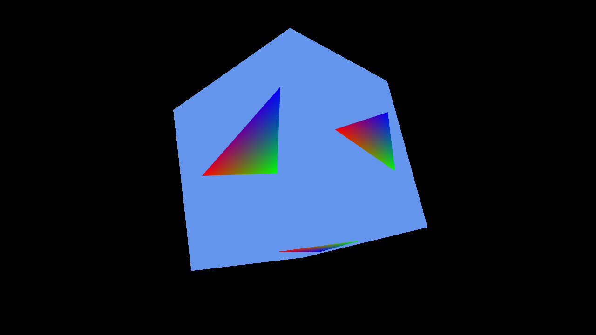
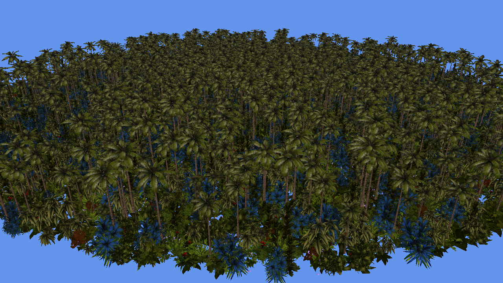
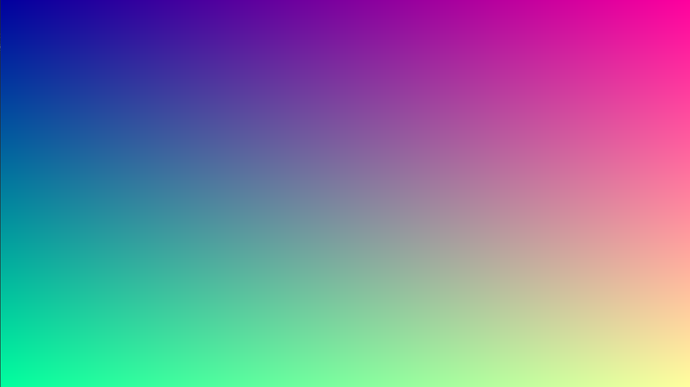
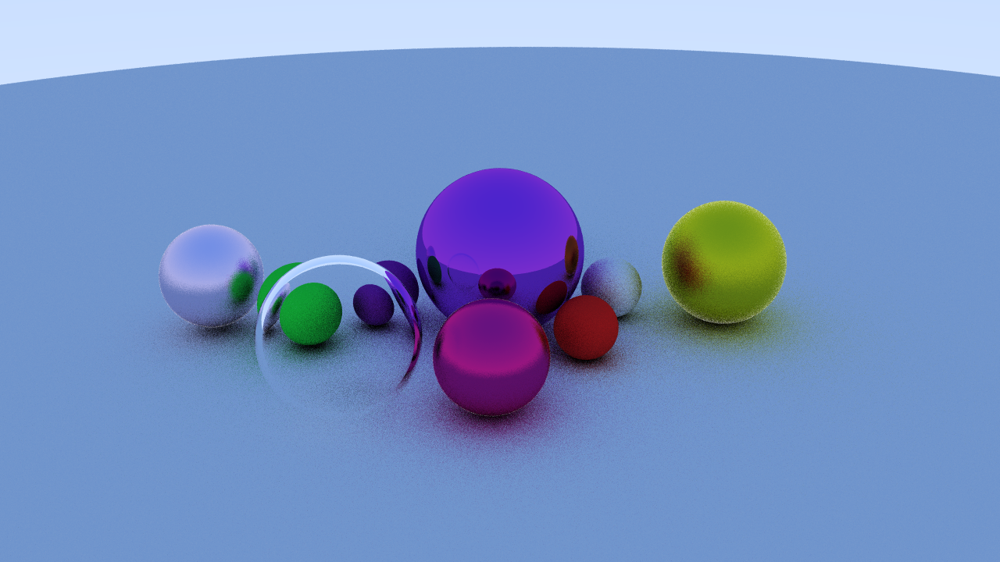

# Low Level API Demo
Set of samples using the Low Level abstraction API over Vulkan, DirectX, OpenGL, Metal.

## Draw Triangle

## Draw Texture Cube

## 2D Texture array

## Stencil outline

## Geometry Shader

## Texture Cube Array

## Render to Texture

## Draw Instance Indirect

## Compute Texture

## Compute Raytracing

## Build and Test

Required Visual Studio 2022 with .NET6 support

----
Powered by **[Evergine 3.2](http://www.Evergine.net)**

LET'S CONNECT!

- [Youtube](https://www.youtube.com/subscription_center?add_user=EvergineChannel)
- [Twitter](https://twitter.com/EvergineTeam)
- [Blog](http://geeks.ms/Evergineteam/)
